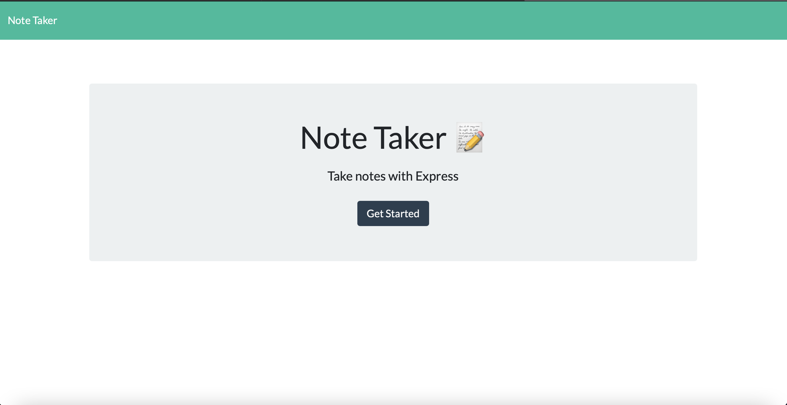
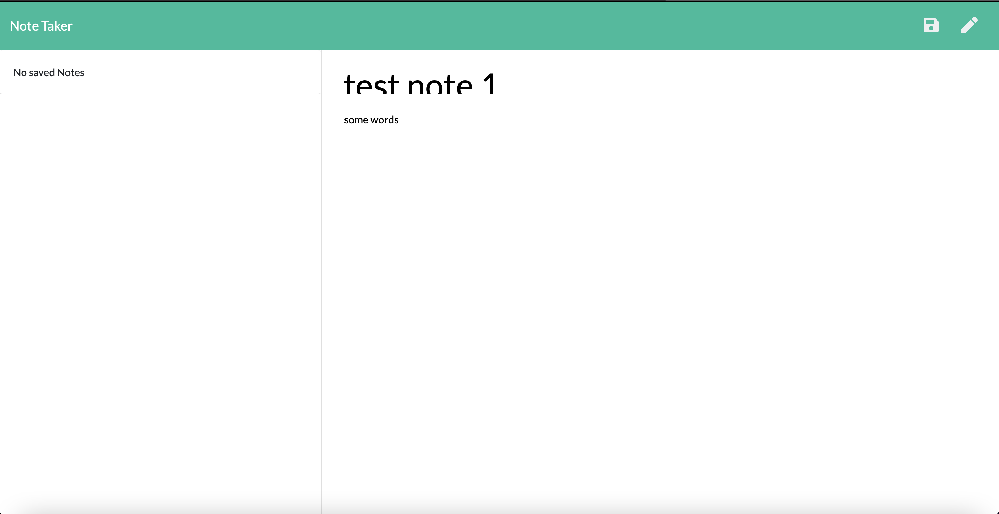
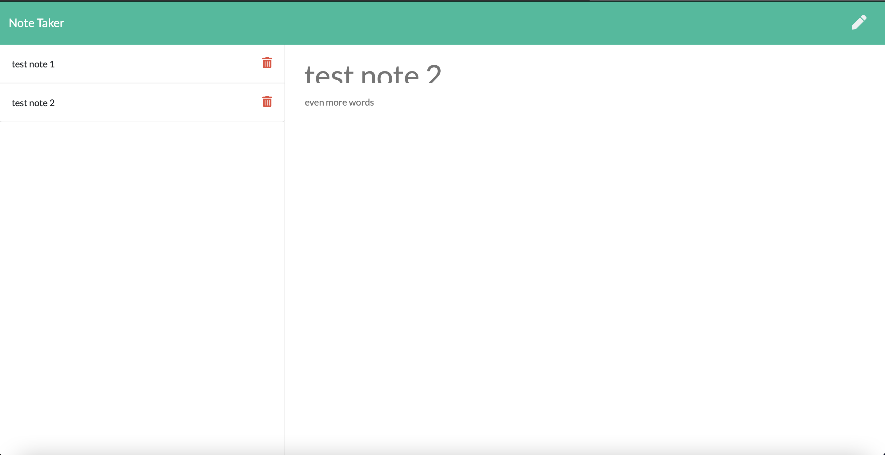

# note-taker-express

# Description of peoject
We were tasked with creating a note taking application that ran off a server locally hosted from our computer

# Links
Repo link:
https://github.com/slimeforest/note-taker-express

Youtube video demonstration:
https://www.youtube.com/watch?v=ne3L5KwpoFU

# screenshots

